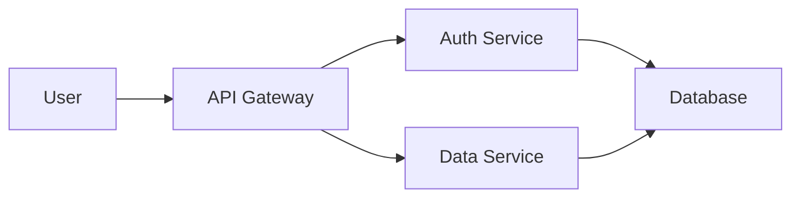

## Images

### Using Markdown syntax

The [markdown syntax](https://www.markdownguide.org/basic-syntax/#images) lets you add images using the following code:

```md

```

<Note>
  Image file size must be less than 5MB. For larger images, host them on a service like [Cloudinary](https://cloudinary.com/) or [S3](https://aws.amazon.com/s3/).
</Note>

### Using HTML img tags

For more customization, use HTML `` tags with inline styles:

```html

```

### With rounded corners


```html

```

### Controlling size

Specify width and height to control image dimensions:


```html

```

## Image organization

<Tabs>
  <Tab title="Local images">
    Store images in your docs directory:
    
    ```
    docs/
    ├── images/
    │   ├── logo.png
    │   ├── screenshot.jpg
    │   └── diagram.svg
    └── getting-started.mdx
    ```
    
    Reference them using root-relative paths:
    
    ```md
    
    ```
  </Tab>
  
  <Tab title="Remote images">
    Host images on a CDN or image hosting service:
    
    ```md
    
    ```
    
    Benefits:
    - Faster page loads
    - No file size limits
    - Image optimization
    - Better caching
  </Tab>
</Tabs>

## Video embeds

Embed videos using iframes for platforms like YouTube, Vimeo, or Loom.

### YouTube

<iframe
  width="560"
  height="315"
  src="https://www.youtube.com/embed/4KzFe50RQkQ"
  title="YouTube video player"
  frameBorder="0"
  allow="accelerometer; autoplay; clipboard-write; encrypted-media; gyroscope; picture-in-picture"
  allowFullScreen
  style={{ width: '100%', borderRadius: '0.5rem' }}
></iframe>

```html
<iframe
  width="560"
  height="315"
  src="https://www.youtube.com/embed/4KzFe50RQkQ"
  title="YouTube video player"
  frameBorder="0"
  allow="accelerometer; autoplay; clipboard-write; encrypted-media; gyroscope; picture-in-picture"
  allowFullScreen
  style={{ width: '100%', borderRadius: '0.5rem' }}
></iframe>
```

### Loom

<iframe
  src="https://www.loom.com/embed/YOUR_VIDEO_ID"
  frameBorder="0"
  allowFullScreen
  style={{ width: '100%', height: '400px', borderRadius: '0.5rem' }}
></iframe>

```html
<iframe
  src="https://www.loom.com/embed/YOUR_VIDEO_ID"
  frameBorder="0"
  allowFullScreen
  style={{ width: '100%', height: '400px', borderRadius: '0.5rem' }}
></iframe>
```

<Tip>
  For YouTube videos, replace the watch URL `youtube.com/watch?v=VIDEO_ID` with the embed URL `youtube.com/embed/VIDEO_ID`.
</Tip>

## Image frames

Add frames to images to make screenshots look more polished:

<Frame>
  
</Frame>

```mdx
<Frame>
  
</Frame>
```

### Frame with caption

<Frame caption="Beautiful landscape from Big Bend National Park">
  
</Frame>

```mdx
<Frame caption="Beautiful landscape from Big Bend National Park">
  
</Frame>
```

## Image comparison

Show before and after or compare different approaches:

<Columns cols={2}>
  <Frame caption="Before optimization">
    
  </Frame>
  <Frame caption="After optimization">
    
  </Frame>
</Columns>

```mdx
<Columns cols={2}>
  <Frame caption="Before optimization">
    
  </Frame>
  <Frame caption="After optimization">
    
  </Frame>
</Columns>
```

## Diagrams and charts

You can embed interactive diagrams and charts:

### Mermaid diagrams



````md

````

## GIFs and animations

Use GIFs to demonstrate workflows or UI interactions:


```html

```

<Warning>
  Keep GIF file sizes small (under 2MB) for fast loading. Consider using video formats like MP4 for longer demonstrations.
</Warning>

## Icons and logos

Display small icons and logos inline with text:

Supported by  Chrome and  Firefox.

```html
Supported by  Chrome
```

## Best practices

<AccordionGroup>
  <Accordion title="Always include alt text" icon="text">
    Alt text improves accessibility and SEO:
    
    ✅ Good: ``
    
    ❌ Bad: ``
  </Accordion>
  
  <Accordion title="Optimize image sizes" icon="gauge-high">
    - Use appropriate dimensions (don't upload 4K images for thumbnails)
    - Compress images before adding them
    - Consider WebP format for better compression
    - Keep file sizes under 200KB when possible
  </Accordion>
  
  <Accordion title="Use descriptive filenames" icon="file-signature">
    Use clear, descriptive names:
    
    ✅ Good: `user-dashboard-dark-mode.png`
    
    ❌ Bad: `screenshot1.png`, `IMG_1234.jpg`
  </Accordion>
  
  <Accordion title="Choose the right format" icon="image">
    - **PNG**: Screenshots, logos, images with transparency
    - **JPG**: Photos, complex images without transparency
    - **SVG**: Icons, simple illustrations (scalable)
    - **GIF**: Simple animations
    - **WebP**: Modern format with better compression
  </Accordion>
  
  <Accordion title="Consider dark mode" icon="moon">
    Some images may not look good in dark mode. You can provide different images for light and dark themes:
    
    ```html
    
    
    ```
  </Accordion>
</AccordionGroup>

## HTML elements

<Tip>
  Mintlify supports [HTML tags in Markdown](https://www.markdownguide.org/basic-syntax/#html). This gives you infinite flexibility for custom layouts and styling.
</Tip>

### Custom styling

Use inline styles or CSS classes for custom appearance:

```html
<div style={{ display: 'flex', gap: '1rem', alignItems: 'center' }}>
  
  <p>Text next to image</p>
</div>
```

### Responsive images

Make images responsive to different screen sizes:

```html

```
